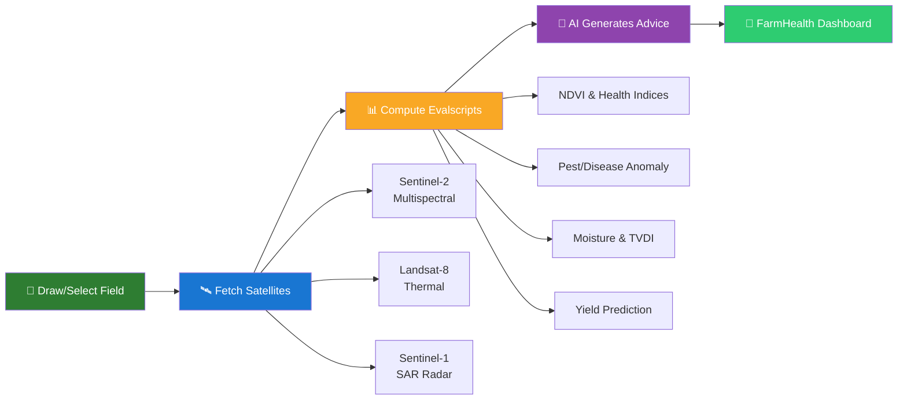

  
  # 🌾 FarmHealth — Satellite Crop Monitor
  
  ### *Advanced Satellite Vision for Precision Agriculture*
  
  **Real-time, pixel-level crop health monitoring and analytics — straight from space to your pocket 🛰️📱**
  
   

  <!-- ====== CATEGORY: FRAMEWORK & LANGUAGES ====== -->
  **📦 Framework & Languages**
  
  
  
  
  

   

  <!-- ====== CATEGORY: MAPS & VISUALIZATION ====== -->
  **🗺️ Mapping & Visualization**
  
  
  
  
  

   

  <!-- ====== CATEGORY: PLATFORMS ====== -->
  **📱 Platforms**
  
  
  
  

   
  
  <!-- ====== STATUS BADGES ====== -->
   
  
  
  
  
   

 

---

  <a href="#-features">✨ Features</a> •
  <a href="#️-how-it-works">🛰️ How It Works</a> •
  <a href="#-authentication-roles">🔐 Roles</a> •
  <a href="#-satellite-data-sources">📡 Satellites</a>

---

## ✨ Features

FarmHealth brings the power of multi-spectral satellites directly to farmers and researchers.

| | Feature | Description | Tech |
|---|---|---|---|
| 🛰️ | **Multi-Satellite Analysis** | Sentinel-2, Sentinel-1 SAR, and Landsat-8 Thermal | ESA + NASA |
| 🌿 | **Crop Health Indices** | NDVI, EVI, NDWI, GNDVI, REIP, SAVI | Sentinel Hub API |
| 🌾 | **Yield Prediction** | Real-time yield algorithmic projection based on area & health | JS Algorithm |
| 🐛 | **Pest Risk Anomaly** | Flagging sudden Red-Edge/NIR drops before visible yellowing | Evalscript |
| 🌡️ | **Thermal Stress (TVDI)** | Land Surface Temperature map using Landsat-8 | Landsat L1C |
| 💧 | **Field Moisture (SAR)** | Soil moisture index using radar backscatter (works through clouds) | Sentinel-1 GRD |
| 🤖 | **AI Agronomist** | Gemini-powered AI field advice based on your coordinates & health | Google Gemini API |
| 🌤️ | **Weather Integration** | Live weather, evapotranspiration, and soil temp | Open-Meteo |
| 📱 | **Offline PWA & Android** | Installs as a native app or PWA via Capacitor | Capacitor JS |
| 🔐 | **Role-based Access** | Admin & User roles to protect API credentials | Secure UI |

<a href="#readme-top">⬆ Back to top</a>

---

## 🛰️ How It Works

---

## 🔐 Authentication Roles

FarmHealth includes a dual-role mock authentication system for demonstration and security:

| Role | Username | Password | Privileges |
|------|----------|----------|------------|
| **Admin** | `admin` | `admin` | Full access to platform. **Can view and edit API credentials** in Settings. |
| **User** | `user` | `user` | Full access to platform features, but API keys are hidden and secured. |

---

## 📡 Satellite Data Sources

1. **Copernicus Sentinel-2**: Provides high-resolution (10m) multispectral imagery for NDVI, EVI, REIP, and pest detection.
2. **Copernicus Sentinel-1 (SAR)**: Synthetic Aperture Radar provides soil moisture measurements that penetrate cloud cover.
3. **NASA Landsat-8/9**: Thermal infrared sensors provide Land Surface Temperature for the Thermal Vegetation Dryness Index (TVDI).

---

  
<b>Made with ❤️ for Global Agriculture</b>

